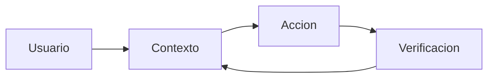

## Que es / para que sirve

El loop operacional resume como Claude Code trabaja: junta contexto, ejecuta acciones, verifica resultados y vuelve a iterar hasta cerrar el objetivo.

## Cuando usarlo

- Cuando necesitas explicar por que Claude Code no es solo una interfaz de chat.
- Cuando quieres decidir donde pedir contexto, donde intervenir y donde verificar.

## Riesgos o limites

- Si el loop no tiene criterios de salida, puede iterar sin foco.
- Si la verificacion se omite, el resultado parece correcto antes de estar validado.

## Fuentes utilizadas

- `anthropic-claude-code-docs-site`

## Siguiente lectura

- [Permisos, sandboxing y checkpoints](/fundamentals-operativos/permisos-sandboxing-y-checkpoints)
- [Explorar un codebase](/workflows/explorar-un-codebase)
