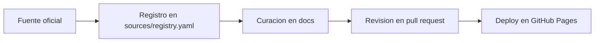

Esta seccion ordenara workflows de uso de Claude Code para desarrollo, investigacion, automatizacion y mantenimiento.

## Flujo editorial inicial

## Temas a cubrir

- Bootstrap de proyectos y scaffolding.
- Analisis de codigo y revisiones tecnicas.
- Generacion de documentacion derivada.
- Mantenimiento de pipelines y operacion del repo.

## Estado

Contenido placeholder. El diagrama Mermaid queda como prueba base del soporte visual del sitio.
