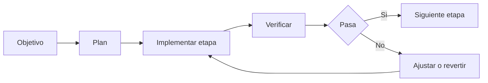

## Que es / para que sirve

Este workflow organiza refactors complejos en etapas verificables para reducir riesgo, mantener foco y facilitar rollback.

## Cuando usarlo

- Cuando el cambio afecta varios archivos o capas.
- Cuando necesitas explicitar antes de tocar codigo que se va a hacer y como se va a validar.

## Riesgos o limites

- Un refactor grande sin plan deriva rapido en cambios sin frontera clara.
- Si los criterios de aceptacion no estan definidos, el trabajo no tiene cierre verificable.

## Pasos

1. Definir objetivo, limite del refactor y criterios de aceptacion.
2. Pedir plan por etapas y checkpoints intermedios.
3. Ejecutar una etapa a la vez.
4. Correr verificaciones despues de cada etapa.
5. Ajustar o revertir antes de seguir si algo falla.

## Criterios de verificacion

- Cada etapa deja evidencia de validacion.
- El sistema sigue funcionando entre etapas, no solo al final.

## Fuentes utilizadas

- `anthropic-claude-code-docs-site`

## Siguiente lectura

- [Permisos, sandboxing y checkpoints](/fundamentals-operativos/permisos-sandboxing-y-checkpoints)
- [Testing y verificacion](/workflows/testing-y-verificacion)
